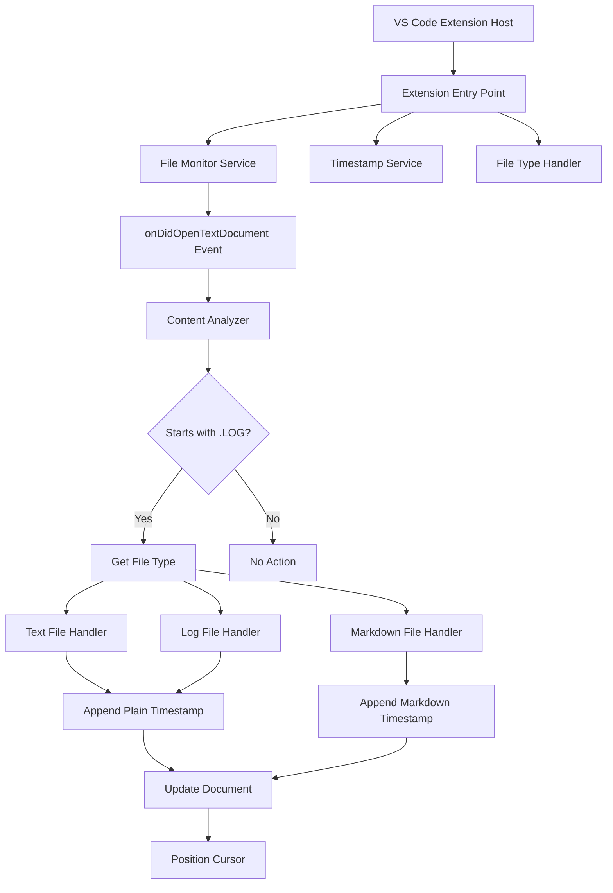

# Design Document

## Overview

The dotLOG extension is a VS Code extension that automatically appends timestamps to files that begin with ".LOG". The extension monitors file open events and applies timestamp logic based on file content and type. It follows VS Code's extension architecture patterns using the Extension API and implements event-driven functionality with minimal performance impact.

## Architecture

The extension follows a modular architecture with clear separation of concerns:



The extension operates as a singleton service that registers event listeners and processes files through a pipeline of handlers.

## Components and Interfaces

### Extension Entry Point (`extension.ts`)

- **Purpose**: Main extension activation and deactivation logic
- **Responsibilities**:
  - Register event listeners for document open events
  - Initialize services and handlers
  - Manage extension lifecycle
- **Key Methods**:
  - `activate(context: vscode.ExtensionContext): void`
  - `deactivate(): void`

### File Monitor Service (`fileMonitor.ts`)

- **Purpose**: Monitors VS Code document events and triggers processing
- **Responsibilities**:
  - Listen to `vscode.workspace.onDidOpenTextDocument` events
  - Filter events for supported file types
  - Coordinate with other services for processing
- **Interface**:

```typescript
interface IFileMonitor {
  startMonitoring(): void;
  stopMonitoring(): void;
  onDocumentOpened(document: vscode.TextDocument): Promise<void>;
}
```

### Content Analyzer (`contentAnalyzer.ts`)

- **Purpose**: Analyzes document content to determine if .LOG processing is needed
- **Responsibilities**:
  - Check if document starts with ".LOG"
  - Validate file type support
  - Return processing decision
- **Interface**:

```typescript
interface IContentAnalyzer {
  shouldProcessDocument(document: vscode.TextDocument): boolean;
  isLogFile(document: vscode.TextDocument): boolean;
}
```

### Timestamp Service (`timestampService.ts`)

- **Purpose**: Generates formatted timestamps
- **Responsibilities**:
  - Create timestamps in "YYYY-MM-DD HH:MM" format
  - Provide consistent timestamp formatting
- **Interface**:

```typescript
interface ITimestampService {
  generateTimestamp(): string;
  formatTimestamp(date: Date): string;
}
```

### File Type Handlers (`handlers/`)

- **Purpose**: Handle timestamp insertion based on file type
- **Responsibilities**:
  - Format timestamps appropriately for each file type
  - Insert timestamps at correct document positions
  - Handle file-specific formatting rules

#### Base Handler Interface

```typescript
interface IFileHandler {
  canHandle(document: vscode.TextDocument): boolean;
  processDocument(document: vscode.TextDocument, timestamp: string): Promise<void>;
}
```

#### Text File Handler (`handlers/textFileHandler.ts`)

- Handles .txt files with plain text timestamp insertion

#### Log File Handler (`handlers/logFileHandler.ts`)

- Handles .log files with plain text timestamp insertion

#### Markdown File Handler (`handlers/markdownFileHandler.ts`)

- Handles .md files with heading 2 (##) timestamp formatting

### Document Editor Service (`documentEditor.ts`)

- **Purpose**: Handles VS Code document editing operations
- **Responsibilities**:
  - Insert text at document positions
  - Position cursor after insertions
  - Handle edit errors gracefully
- **Interface**:

```typescript
interface IDocumentEditor {
  insertTextAtEnd(document: vscode.TextDocument, text: string): Promise<boolean>;
  positionCursorAtEnd(document: vscode.TextDocument): Promise<void>;
}
```

## Data Models

### Document Processing Context

```typescript
interface DocumentContext {
  document: vscode.TextDocument;
  fileType: SupportedFileType;
  timestamp: string;
  shouldProcess: boolean;
}

enum SupportedFileType {
  TEXT = 'txt',
  LOG = 'log',
  MARKDOWN = 'md'
}
```

### Processing Result

```typescript
interface ProcessingResult {
  success: boolean;
  error?: string;
  documentModified: boolean;
}
```

## Error Handling

The extension implements comprehensive error handling at multiple levels:

### File Access Errors

- **Scenario**: Read-only files, permission issues
- **Handling**: Log error, skip processing, continue monitoring
- **User Impact**: Silent failure with console logging

### Document Editing Errors

- **Scenario**: Document modification failures
- **Handling**: Retry once, then log and skip
- **User Impact**: No timestamp added, no user notification

### Extension Lifecycle Errors

- **Scenario**: Service initialization failures
- **Handling**: Disable extension functionality, log critical error
- **User Impact**: Extension becomes inactive

### Error Logging Strategy

- Use VS Code's output channel for debugging information
- Implement different log levels (info, warn, error)
- Include context information in error messages
- Never show intrusive error dialogs to users

## Testing Strategy

### Unit Testing

- **Framework**: Jest with VS Code extension testing utilities
- **Coverage**: All service classes and handlers
- **Focus Areas**:
  - Content analysis logic
  - Timestamp formatting
  - File type detection
  - Error handling paths

### Integration Testing

- **Framework**: VS Code Extension Test Runner
- **Scenarios**:
  - End-to-end document processing
  - Event listener registration
  - Multi-file type handling
  - Performance under load

### Test File Structure

```
test/
├── unit/
│   ├── contentAnalyzer.test.ts
│   ├── timestampService.test.ts
│   └── handlers/
│       ├── textFileHandler.test.ts
│       ├── logFileHandler.test.ts
│       └── markdownFileHandler.test.ts
├── integration/
│   ├── extension.test.ts
│   └── fileProcessing.test.ts
└── fixtures/
    ├── sample.txt
    ├── sample.log
    └── sample.md
```

### Performance Testing

- **Metrics**: Processing time under 100ms requirement
- **Load Testing**: Multiple simultaneous file opens
- **Memory Testing**: Extension memory footprint monitoring
- **Benchmarking**: Compare performance with and without extension active

## Implementation Notes

### VS Code API Usage

- Primary event: `vscode.workspace.onDidOpenTextDocument`
- Document editing: `vscode.WorkspaceEdit` and `vscode.window.activeTextEditor`
- File type detection: `vscode.TextDocument.languageId` and file extension parsing

### Performance Considerations

- Lazy loading of services to minimize activation time
- Debouncing of rapid file open events
- Minimal document content scanning (only first line check)
- Asynchronous processing to avoid blocking UI

### Extension Manifest Requirements

- Activation events: `onLanguage:plaintext`, `onLanguage:log`, `onLanguage:markdown`
- Required permissions: File system read/write access
- Contribution points: None (background functionality only)
