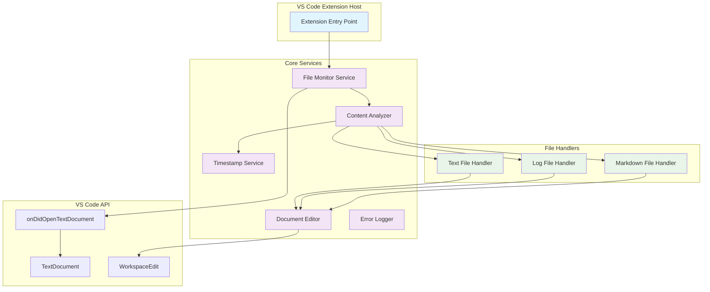

# Architecture Documentation

## Overview

The dotLOG extension is built using a modular, event-driven architecture that follows VS Code extension best practices. This document provides detailed technical information about the system design and implementation.

## System Architecture



## Component Details

### Extension Entry Point (`extension.ts`)

**Responsibilities:**

- Extension lifecycle management (activate/deactivate)
- Service initialization and dependency injection
- Event listener registration
- Resource cleanup

**Key Methods:**

```typescript
export function activate(context: vscode.ExtensionContext): void
export function deactivate(): void
```

**Activation Flow:**

1. Initialize core services
2. Register document open event listeners
3. Set up error handling
4. Store disposables in extension context

### File Monitor Service (`fileMonitor.ts`)

**Purpose:** Central event coordinator that listens to VS Code document events and orchestrates the processing pipeline.

**Event Handling:**

- Listens to `vscode.workspace.onDidOpenTextDocument`
- Filters events for supported file types
- Debounces rapid successive events
- Coordinates with other services

**Performance Considerations:**

- Lazy evaluation of document content
- Early exit for unsupported file types
- Asynchronous processing to avoid UI blocking

### Content Analyzer (`contentAnalyzer.ts`)

**Purpose:** Analyzes document content to determine processing requirements.

**Analysis Logic:**

```typescript
public shouldProcessDocument(document: vscode.TextDocument): boolean {
  // Check if document has content
  if (document.lineCount === 0) return false;
  
  // Check first line for .LOG marker
  const firstLine = document.lineAt(0).text.trim();
  return firstLine === '.LOG';
}
```

**File Type Detection:**

- Uses VS Code's `languageId` property
- Falls back to file extension parsing
- Supports .txt, .log, and .md files

### Timestamp Service (`timestampService.ts`)

**Purpose:** Generates consistent timestamp formatting across all file types.

**Format Specification:**

- Pattern: `yyyy-MM-dd hh:MM AM/PM`
- Uses local system time
- 12-hour format
- Zero-padded values

**Implementation:**

```typescript
public generateTimestamp(): string {
  const now = new Date();
  return this.formatTimestamp(now);
}

formatTimestamp(date: Date): string {
    const year = date.getFullYear();
    const month = String(date.getMonth() + 1).padStart(2, '0');
    const day = String(date.getDate()).padStart(2, '0');

    // Convert to 12-hour format
    const hours24 = date.getHours();
    const hours12 = hours24 === 0 ? 12 : hours24 > 12 ? hours24 - 12 : hours24;
    const ampm = hours24 >= 12 ? 'PM' : 'AM';

    const hours = String(hours12).padStart(2, '0');
    const minutes = String(date.getMinutes()).padStart(2, '0');

    return `${year}-${month}-${day} ${hours}:${minutes} ${ampm}`;
  }
```

### File Type Handlers

**Base Handler Interface:**

```typescript
interface IFileHandler {
  canHandle(document: vscode.TextDocument): boolean;
  processDocument(document: vscode.TextDocument, timestamp: string): Promise<void>;
}
```

**Handler Implementations:**

#### Text File Handler (`textFileHandler.ts`)

- Handles .txt files
- Appends plain text timestamp
- Adds newline separation

#### Log File Handler (`logFileHandler.ts`)

- Handles .log files
- Identical to text file handling
- Plain text timestamp format

#### Markdown File Handler (`markdownFileHandler.ts`)

- Handles .md files
- Formats timestamp as level 2 heading (`## timestamp`)
- Maintains markdown structure

### Document Editor Service (`documentEditor.ts`)

**Purpose:** Handles all VS Code document editing operations with error handling.

**Key Operations:**

- Text insertion at document end
- Cursor positioning after insertion
- Error recovery for failed edits

**Edit Process:**

1. Create `WorkspaceEdit` instance
2. Calculate insertion position (end of document)
3. Apply edit through VS Code API
4. Position cursor after inserted text
5. Handle any edit failures gracefully

## Data Flow

### Document Processing Pipeline

1. **Event Trigger**: User opens a document
2. **Event Filtering**: File monitor checks file type
3. **Content Analysis**: Analyzer checks for .LOG marker
4. **Handler Selection**: Appropriate handler is selected
5. **Timestamp Generation**: Service creates formatted timestamp
6. **Document Editing**: Handler inserts timestamp with proper formatting
7. **Cursor Positioning**: Editor positions cursor for user input

### Error Handling Flow

1. **Error Detection**: Service encounters error condition
2. **Error Classification**: Determine error type and severity
3. **Recovery Attempt**: Try alternative approaches if applicable
4. **Logging**: Record error details for debugging
5. **Graceful Degradation**: Continue operation without user interruption

## Performance Characteristics

### Processing Time Requirements

- **Target**: < 100ms from document open to timestamp insertion
- **Measurement Points**:
  - Event detection to processing start
  - Content analysis duration
  - Document editing completion

### Memory Usage

- **Lazy Loading**: Services initialized only when needed
- **Event Cleanup**: Proper disposal of event listeners
- **Minimal State**: No persistent document state maintained

### Optimization Strategies

- **Early Exit**: Skip processing for non-.LOG files immediately
- **Async Operations**: Non-blocking document editing
- **Debouncing**: Prevent duplicate processing of rapid events

## Extension Manifest Configuration

### Activation Events

```json
{
  "activationEvents": [
    "onLanguage:plaintext",
    "onLanguage:log", 
    "onLanguage:markdown"
  ]
}
```

### Required Permissions

- File system read access (implicit with VS Code API)
- Document editing capabilities
- Event listener registration

## Testing Architecture

### Test Categories

1. **Unit Tests**: Individual component testing
   - Service method testing
   - Handler logic verification
   - Error condition testing

2. **Integration Tests**: Component interaction testing
   - End-to-end document processing
   - Service coordination verification
   - Event handling validation

3. **Performance Tests**: Timing and resource usage
   - Processing time measurement
   - Memory usage monitoring
   - Load testing with multiple files

### Test Infrastructure

- **Framework**: Mocha with VS Code test utilities
- **Mocking**: Service dependencies mocked for isolation
- **Fixtures**: Sample files for consistent testing
- **Coverage**: Comprehensive test coverage reporting

## Security Considerations

### File Access

- Only processes files explicitly opened by user
- No background file system scanning
- Respects VS Code's file access permissions

### Error Information

- Error logs contain no sensitive user data
- File paths are sanitized in error messages
- No network communication or data transmission

## Future Architecture Considerations

### Extensibility Points

- Plugin system for additional file type handlers
- Configurable timestamp formats
- Custom processing rules

### Scalability

- Support for larger documents
- Batch processing capabilities
- Performance optimization for high-frequency usage

### Maintainability

- Clear separation of concerns
- Comprehensive documentation
- Automated testing coverage
- Consistent code patterns
